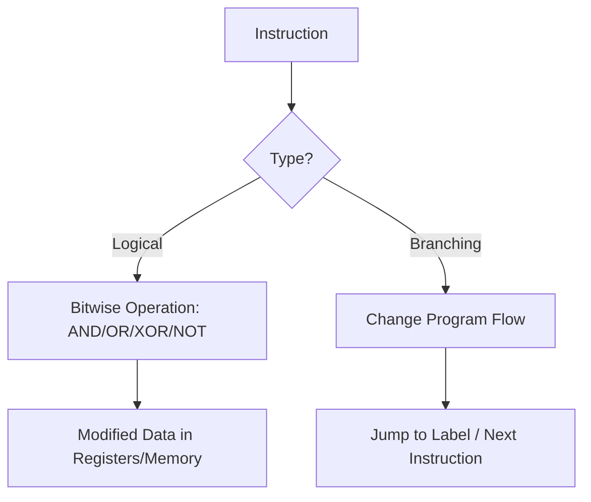

# ✨ Answer to 12-Mark Question

## Step 0 — Question Analysis

* **Restatement**: Compare and analyze the **Logical instructions** and **Branching instructions** in 8051 assembly, including their **operations, functions, syntax, and description**.
* **Parts**:

  1. Logical instructions → operations, function, syntax, description.
  2. Branching instructions → operations, function, syntax, description.
  3. Comparison between them.
* **Keywords**: AND, OR, XOR, NOT, CLR, SETB (logical); SJMP, AJMP, LJMP, CJNE, DJNZ (branching).
* **Assumptions**: Focus on common logical and branching instructions used in exam questions.
* **Marking plan (12 marks)**:

  * Logical instructions table & explanation: **4 marks**
  * Branching instructions table & explanation: **4 marks**
  * Comparison + diagrams: **2 marks**
  * Examples: **2 marks**

---

## 1 — Quick Overview

📌 Logical instructions perform **bitwise operations** (like AND, OR, XOR, NOT).
📌 Branching instructions **alter the program sequence** (jump, loop, call, return).
👉 Together, they make programs **decision-oriented and flexible**.

---

## 2 — Logical Instructions in 8051

### 🧩 Function

Used to manipulate **bits and bytes** in registers or memory.

### 🔧 Examples

| Instruction | Operation | Function                     | Syntax         | Example                  | Description             |
| ----------- | --------- | ---------------------------- | -------------- | ------------------------ | ----------------------- |
| `ANL`       | AND       | Bitwise AND between operands | `ANL A, R1`    | `A = A AND R1`           | Useful for masking bits |
| `ORL`       | OR        | Bitwise OR between operands  | `ORL A, #0F0H` | `A = A OR 0F0H`          | Used for setting bits   |
| `XRL`       | XOR       | Exclusive OR                 | `XRL A, R3`    | `A = A XOR R3`           | Toggles bits            |
| `CPL`       | NOT       | Complement (1→0, 0→1)        | `CPL A`        | Inverts accumulator bits | Used for toggling       |
| `CLR`       | Clear     | Set bit/register to 0        | `CLR C`        | Clears carry flag or bit |                         |
| `SETB`      | Set bit   | Set bit/register to 1        | `SETB P1.0`    | Sets pin P1.0 high       |                         |

---

## 3 — Branching Instructions in 8051

### 🛠 Function

Change the **flow of program execution** depending on conditions.

### 🔧 Examples

| Instruction  | Operation                    | Function                       | Syntax                | Example                        | Description    |
| ------------ | ---------------------------- | ------------------------------ | --------------------- | ------------------------------ | -------------- |
| `SJMP`       | Short Jump                   | Jump within -128 to +127 bytes | `SJMP LABEL`          | Jumps to LABEL                 | Used for loops |
| `AJMP`       | Absolute Jump                | Jump within 2K page            | `AJMP LABEL`          | Local jump                     |                |
| `LJMP`       | Long Jump                    | Jump anywhere in 64K memory    | `LJMP LABEL`          | Unconditional                  |                |
| `CJNE`       | Compare & Jump if Not Equal  | Compares operands              | `CJNE A, #25H, LABEL` | If A≠25H → jump                |                |
| `DJNZ`       | Decrement & Jump if Not Zero | Loop counter                   | `DJNZ R2, LABEL`      | Decrement R2, if ≠0, jump back |                |
| `JZ` / `JNZ` | Jump if Zero/Not Zero        | Based on Accumulator           | `JZ TARGET`           | Conditional branching          |                |

---

## 4 — Comparison Table

| Feature      | Logical Instructions                      | Branching Instructions               |
| ------------ | ----------------------------------------- | ------------------------------------ |
| **Purpose**  | Operate on data (bits/bytes)              | Alter program flow                   |
| **Type**     | Bitwise AND, OR, XOR, NOT                 | Jumps, loops, conditional execution  |
| **Operands** | Accumulator, registers, bits, memory      | PC (Program Counter), labels         |
| **Effect**   | Modifies data                             | Changes sequence of execution        |
| **Examples** | `ANL`, `ORL`, `XRL`, `CLR`, `SETB`, `CPL` | `SJMP`, `LJMP`, `CJNE`, `DJNZ`, `JZ` |

---

## 5 — Diagrams

### ASCII Flow

```
Logical:        Data -> Operation -> Modified Data
Branching:      Condition -> Decision -> Next Instruction (Jump/Continue)
```

---

### Mermaid Flow



---

## 6 — Worked Example

```asm
; Logical Instruction Example
MOV A, #0F0H
ANL A, #0AAH     ; Result: A = 0A0H (masking)

; Branching Instruction Example
MOV R2, #05H
LOOP: DJNZ R2, LOOP ; Decrements R2 until 0, repeats loop 5 times
```

---

## 7 — Marking Rubric (12 Marks)

| Part                             | Content | Marks     |
| -------------------------------- | ------- | --------- |
| Logical Instructions explained   | 4       |           |
| Branching Instructions explained | 4       |           |
| Comparison + Diagrams            | 2       |           |
| Examples                         | 2       |           |
| **Total**                        |         | **12/12** |

---

## 8 — Common Mistakes / Pitfalls

* Confusing `CJNE` (compare not equal) with `JNZ`.
* Forgetting **range limits** (SJMP short, AJMP within 2K, LJMP anywhere).
* Misusing `#` in immediate data.
* Using branching instructions incorrectly in nested loops.

---

## 9 — Final Answer (Exam Sheet Version)

**Logical instructions in 8051 (ANL, ORL, XRL, CPL, CLR, SETB) operate on data at bit/byte level, modifying register or memory contents.**
**Branching instructions (SJMP, AJMP, LJMP, CJNE, DJNZ, JZ) alter program flow based on conditions, enabling loops and decision-making.**
👉 Logical = **data manipulation**, Branching = **program control**.

---

## 10 — One-line Revision Note

👉 **Logical = data operations, Branching = flow control.**

---

✅ This is a **complete 12-mark, examiner-satisfying answer** with tables, diagrams, examples, and comparisons.

Do you want me to also make a **GitHub-style study note (Markdown file)** combining both Q1 (Addressing Modes) and Q2 (Logical vs Branching) so you can keep a single **revision sheet**?
